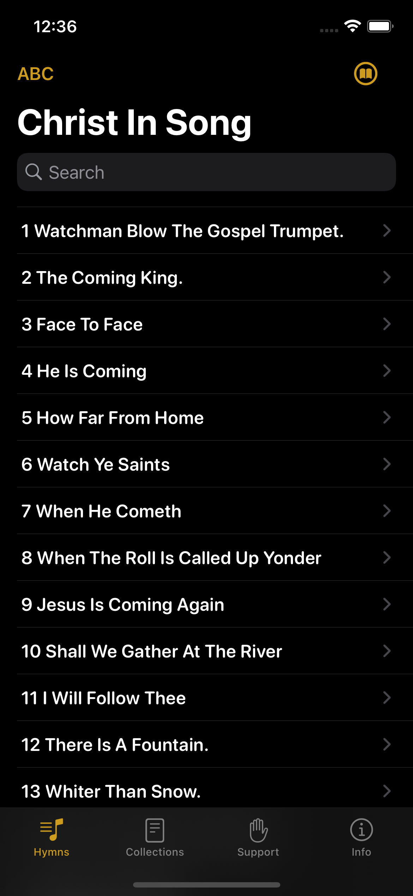
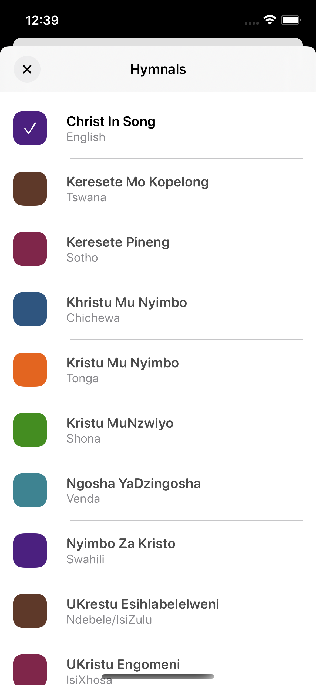
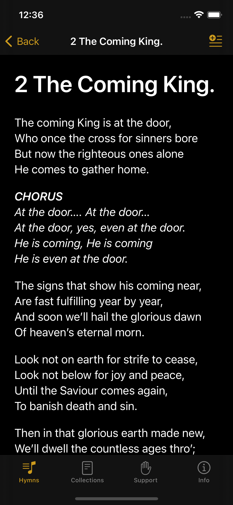
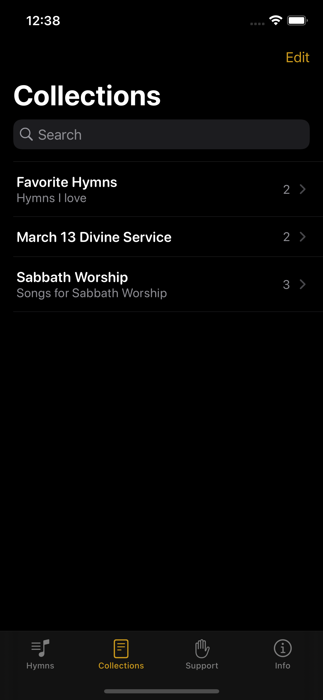
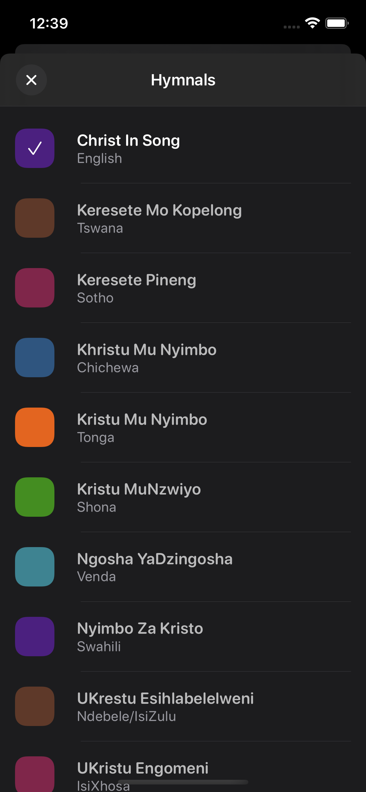

# Christ In Song iOS App  

**Christ In Song** is a collection of SDA venecular hymns available in multiple languages. 

Written entirely in SwiftUi (beginner level). 

## Screenshots

## Hymnals - Language

See available languages at [cis-hymnals](https://github.com/TinasheMzondiwa/cis-hymnals) with instructions on how to suggest new languages or correct typos.

## Contributions

Contributions are most welcome in the form of Github issues and pull-requests.

## Building project
* Clone the repo - `git clone`
* Get submodules - `git submodule update --init --recursive`
* Installs pods - `pods - install`
* Launch `ChristInSong.xcworkspace`

## Links

## License

    Copyright 2023 Tinashe Mzondiwa
    
    Licensed under the Apache License, Version 2.0 (the "License");
    you may not use this file except in compliance with the License.
    You may obtain a copy of the License at
    
       http://www.apache.org/licenses/LICENSE-2.0
    
    Unless required by applicable law or agreed to in writing, software
    distributed under the License is distributed on an "AS IS" BASIS,
    WITHOUT WARRANTIES OR CONDITIONS OF ANY KIND, either express or implied.
    See the License for the specific language governing permissions and
    limitations under the License.
